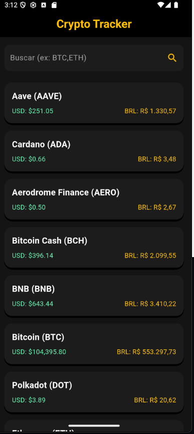
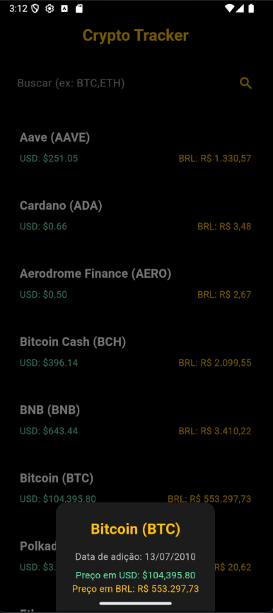

# 📈 App de Cotação de Criptomoedas com Flutter

Um aplicativo desenvolvido em **Flutter** que exibe as principais criptomoedas com suas cotações em tempo real, utilizando a **API da CoinMarketCap**. O projeto segue a arquitetura **MVVM+Repository**, garantindo código limpo, modular e escalável.

---

## 📷 Screenshots

| Tela Principal | Detalhes da Moeda |
|----------------|-------------------|
|  |  |

---

## ✨ Funcionalidades

- **Listagem em Tempo Real:** Atualização automática das principais criptomoedas.
- **Cotação em USD e BRL:** Conversão automática com base na taxa atual USD → BRL.
- **Atualização de Dados:**
  - Gesto "Pull-to-Refresh"
  - Botão de atualização
- **Busca Dinâmica:** Pesquisa por símbolo (ex: BTC, ETH, SOL).
- **Detalhes da Moeda:** Informações completas em um modal: nome, símbolo, data e valores formatados.
- **Interface Reativa:** Indicadores de carregamento, sucesso ou erro.

---

## 🏗️ Arquitetura

O projeto adota uma arquitetura baseada em **MVVM + Repository**, promovendo separação de responsabilidades:

```
View ↔ ViewModel → Repository → DataSource → API
```

### Camadas:

- **View (`view/`)**: UI da aplicação (ex: `home_page.dart`)
- **ViewModel (`viewmodel/`)**: Gerencia estados e lógica da UI
- **Repository (`repository/`)**: Responsável por fornecer dados vindos do DataSource
- **DataSource (`data/`)**: Responsável pelas requisições HTTP
- **Model (`model/`)**: Define as estruturas de dados da aplicação

---

## 🚀 Tecnologias e Pacotes

- **[Flutter](https://flutter.dev/)**: Framework principal
- **[Dart](https://dart.dev/)**: Linguagem
- **[provider](https://pub.dev/packages/provider)**: Gerenciamento de estado
- **[http](https://pub.dev/packages/http)**: Requisições HTTP
- **[intl](https://pub.dev/packages/intl)**: Formatação de moeda e datas

---

## ⚙️ Como Executar o Projeto

### Pré-requisitos

- Flutter SDK instalado
- VS Code / Android Studio
- Emulador ou dispositivo físico

### Passos

```bash
git clone https://github.com/msouza009/coinmarketcap
cd coinmarketcap
flutter pub get
```

### Configuração da API

1. Crie uma conta gratuita em: https://pro.coinmarketcap.com/
2. Copie sua chave de API.
3. No arquivo `lib/data/coin_datasource.dart`, substitua o valor da `_apiKey`:

```dart
const String _apiKey = 'SUA_CHAVE_API';
```

### Rodando o App

```bash
flutter run
```

---

## 📁 Estrutura do Projeto

```
lib/
├── data/
│   └── coin_datasource.dart          # Acesso à API da CoinMarketCap
├── model/
│   └── coin.dart                     # Modelo da moeda
├── repository/
│   └── coin_repository.dart          # Lógica de repositório
├── view/
│   └── home_page.dart                # Interface do usuário
├── viewmodel/
│   └── coin_viewmodel.dart           # Estado e lógica de apresentação
└── main.dart                         # Ponto de entrada
```

